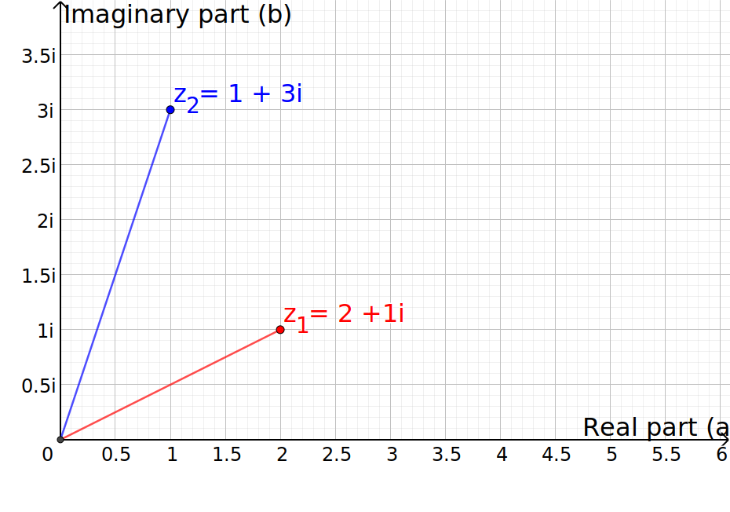

# Mandelbrot set
In this section we define the Mandelbrot set and give the code for visualisation in Python and JavaScript.

---

## A bit of history...
Thes Mandelbrot set was first investigated in the 20th century by the French mathematicians Pierre Fatou and Gaston Julia (see the [Julia Set](julia_set.md)). It was popularized in 1980 thanks the visualization of the set created by [Benoit Mandelbrot](https://en.wikipedia.org/wiki/Benoit_Mandelbrot), who worked at IBM at the time.

## Mathematical definition
The Mandelbrot set is defined as the set of complex numbers $$c$$ where the function $$f_c(z) = z^2 +c$$ remains bounded when iterated in zero.

Less formally, it is all the complex numbers for which the sequence

$$ f_c(0),\quad f_c(f_c(0)),\quad f_c(f_c(f_c(0))), \ldots $$

doesn't goes to infinity and is bounded by a certain value.

Knowing that $$f_c(z) = z^2 + c$$, we can write the sequence as

$$ c,\quad c^2 + c,\quad (c^2+c)^2 + c, \ldots $$

## Graphical representation
To represent this set, we need to compute the sequence for each number and then plot the boundaries of the set.
In order to have a graphical representation, we need a way of displaying a single complex number $$c$$ in 2 dimensions.
Fortunately, we know that any complex number $$c$$ can be written as number with a real part ($$a$$) and an imaginary part ($$b$$)

$$ c = a + bi \text{.}$$

From here, two dimensional representation is straightforward. We plot the real part of the number on the x-axis and the imaginary part on the y-axis. This gives us a grid to represent any complex number. As a example the image below display two complex numbers $$z_1$$ and $$z_2$$ using this representation technique.

### Sequence computation
Now that we have a way of representing our complex numbers in 2 dimensions, we need to compute the sequence for each number and see if it goes to infinity. Theoretically, the number of iteration should be infinite but in our practical case, it is impossible to do so.

Therefore, let us define $$n$$, the number of iteration for each complex, i.e. the length of the sequence. And let us fix $$n=100$$ for good measure. We now need to express our sequence in terms of *real* and *imaginary* part.

$$ c = a +bi \text{,} \quad c^2=a^2+2abi+b^2i^2 \quad \text{and} \quad i^2 = -1$$

So we can rewrite $$c^2$$ as

$$  a^2+2abi-b^2 = (a^2-b^2) + (2ab)i $$

And here, we clearly see that this number is also a complex where the new $$a_{j+1}$$ is $$a_j^2-b_j^2$$ and the new $$b_{j+1}$$ is $$2a_jb_j$$. Let's not forget that at each iteration is also added $$c$$, the "original" complex number at which the sequence is computed. We can write it $$a_{0} +b_{0}i$$. Therefore, if we generalize this we can write this recursive definition:

$$a_{j+1}+b_{j+1} = (a_j^2-b_j^2 + a_0) + (2a_jb_j + b_0)i \quad \text{for} \quad j=1,\ldots,n$$

